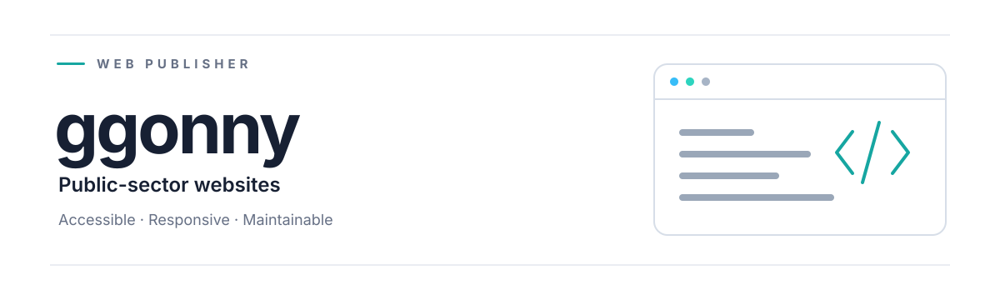
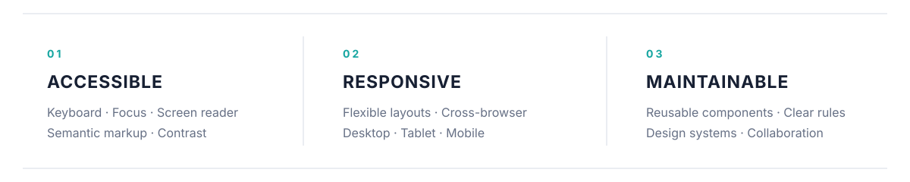

  

  

 

<strong>TOOLKIT</strong>

  
  &nbsp;&nbsp;
  
  &nbsp;&nbsp;
  
  &nbsp;&nbsp;
  
  &nbsp;&nbsp;
  

  HTML5&nbsp;&nbsp;·&nbsp;&nbsp;CSS3&nbsp;&nbsp;·&nbsp;&nbsp;SCSS&nbsp;&nbsp;·&nbsp;&nbsp;JavaScript&nbsp;&nbsp;·&nbsp;&nbsp;jQuery

 

<strong>LIBRARIES</strong>

  Swiper&nbsp;&nbsp;&nbsp;/&nbsp;&nbsp;&nbsp;slick.js&nbsp;&nbsp;&nbsp;/&nbsp;&nbsp;&nbsp;GSAP&nbsp;&nbsp;&nbsp;/&nbsp;&nbsp;&nbsp;AOS

 

  <strong>CURRENT FOCUS</strong>  
  Vanilla JavaScript&nbsp;&nbsp;·&nbsp;&nbsp;React&nbsp;&nbsp;·&nbsp;&nbsp;KRDS-based UI systems

